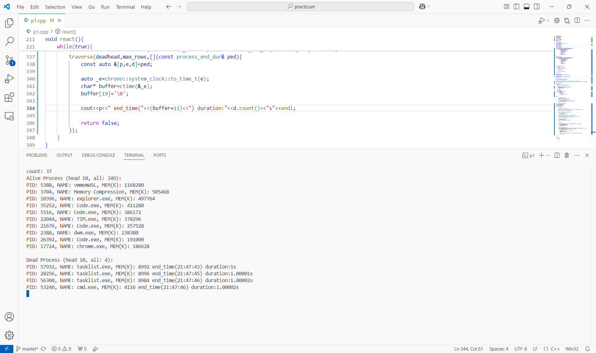
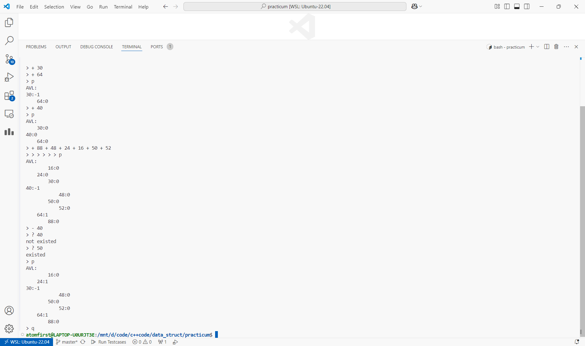

# 数据结构课程设计

## 目录

1. 系统进程统计
2. 迷宫问题
3. 家谱管理系统
4. 平衡二叉树编程
5. Huffman编码与解码
6. 地铁修建
7. 公交线路提示
8. B - 树应用
9. 排序算法比较
10. 算术表达式求值（14题，选做）

---

### 1. 系统进程统计

主要数据结构：链表

算法思想：

链表的建立，插入，删除，查询和相对补运算。

在 `Windows` 和 `Linux` 平台上均可运行。 `Windows` 版本可以键入 `q` （无回显）退出，`Linux` 版本没有实现退出功能，可以 `Ctrl-C` 强制退出。

测试结果：

测试程序在 [p1.cpp](./p1.cpp) 中。

请运行 `test.sh` 脚本获得各程序运行结果，即在命令行输入

```bash
chmod +x test.sh && ./test.sh 1
```

Windows 版本指令

```ps
g++ -std=c++20 p1.cpp -o p1.exe
.\p1.exe
```

运行截图（部分，全部结果请运行脚本获得）




算法分析：

时间复杂度为 $O(nm)$ ，其中 $n,m$ 分别为当前进程数和已结束进程数。由于数据规模很小，可以满足需要。

### 2. 迷宫问题

主要数据结构：栈

算法思想：

用栈模拟递归。栈中存放原递归函数的所有局部变量（包括参数），原调用过程对应进栈，原递归函数退出对应出栈。

```cpp
    // ...
    s.emplace(sx,sy,0,0);

    while(s.size()){
        auto &[x,y,d,i]=s.top();

        if(i==4){
            path[x][y]=-1; s.pop(); 
            continue;
        }
        
        if(i==0) path[x][y]=d,visited[x][y]=1;

        if(x==ex && y==ey) break;

        int nx=x+dx[i],ny=y+dy[i];
        ++i;

        if(!in_map(nx,ny) || visited[nx][ny] || maze[nx][ny]=='#') continue;

        s.emplace(nx,ny,d+1,0);
    }
```

测试结果：

测试程序在 [p2.cpp](./p2.cpp) 中。

请运行 `test.sh` 脚本获得各程序运行结果，即在命令行输入

```bash
chmod +x test.sh && ./test.sh 2
# 程序显示迷宫地图 ...
# 输入任意起点及终点
19 4 11 20
# 程序输出路线 ...
# 退出程序
0 0 0 0
```

运行截图（部分，全部结果请运行脚本获得）


算法分析：

时间复杂度为 $O(nm)$ ，其中 $n,m$ 为迷宫的尺寸。需要注意结果不一定是最短路，如果需要最短路应采用 `BFS` ，但题目要求栈实现。如果使用 `DFS` 获得最短路，所需时间复杂度不是多项式级别的，会导致程序反应慢，所以不采用。

### 3. 家谱管理系统

主要数据结构：树

算法思想：

实现了一个树状家谱的增删改查系统。

测试结果：

测试程序在 [p3.cpp](./p3.cpp) 中，家谱数据在 [input/家谱.txt](./input/家谱.txt) 中。

请运行 `test.sh` 脚本获得各程序运行结果，即在命令行输入

```bash
chmod +x test.sh && ./test.sh 3
# 输入命令
# 程序输出
```

测试数据：

```bash
tree
generation 3
show_data 王文远
select_by_date_of_birth 1950-07-04
relationship 王景飞 王子晨
add_child 王源 王芙蓉
delete 王浩
change 王芙蓉 1946-4-2 true 重庆 true -
tree
save 家谱（新）.txt
exit
```

运行截图（部分，全部结果请运行脚本获得）


算法分析：

大部分操作需要遍历树进行查找，时间复杂度为 $O(n)$ ，介于数据规模极小，不建议优化。

### 4. 平衡二叉树编程

主要数据结构： `AVL` 树

算法思想：

实现了一个 `AVL` 树，可作为一个集合使用，要求元素可比较大小。

测试结果：

测试程序在 [p4.cpp](./p4.cpp) 中。

请运行 `test.sh` 脚本获得各程序运行结果，即在命令行输入

```bash
chmod +x test.sh && ./test.sh 4
```

另外内置了一个交互式的程序进行测试，通过以下命令编译运行

```bash
g++ -std=c++20 -DINTERACT p4.cpp && ./a.out
```

运行截图（部分，全部结果请运行脚本获得）



算法分析：

插入，删除和查询复杂度均为 $log(n)$ ， $n$ 为平衡树内的元素数量。

### 5. Huffman编码与解码

主要数据结构：哈夫曼树

算法思想：

根据字符出现频率构造哈夫曼树并生成对应编码。

由于使用二进制文件存储，而编码总长度不一定为八的倍数，解码时可能误读无效比特而导致错误。因此加入一个结束标志 `EOF` ，读到 `EOF` 后解码停止，解决了这个问题。

```cpp
    // decode
    ifstream fin2("code.dat",ios::in|ios::binary);
    ofstream fout("recode.txt",ios::out);
    auto cur=root; bool end=0;

    for(char buffer;fin2.read(&buffer,1) && !end;){
        for(int i=0;i<8;i++){
            if(cur->elem>0){
                fout<<(cur->elem);
                cur=root;
            }else if(cur->elem=='\0'){
                end=1; break;
            }

            if((buffer>>i)&1)
                cur=cur->right;
            else
                cur=cur->left;
        }
    }
```

测试结果：

测试程序在 [p5.cpp](./p5.cpp) 中，测试数据在 [input/source.txt](./input/source.txt) 中。

请运行 `test.sh` 脚本获得各程序运行结果，即在命令行输入

```bash
chmod +x test.sh && ./test.sh 5
# 比较解码后的文件和原文件
diff recode.txt input/source.txt
```

运行截图（部分，全部结果请运行脚本获得）


算法分析：

时间复杂度为 $O(n+mlog(m))$ ，其中 $n$ 为原始文本长度， $m$ 为文本中字符种类数量，$log$ 是每次找到最小总频率的两个节点的时间（通过堆维护）。

编码后文件大小约为原文件的一半，实现了体积的压缩。

本实现以一个字节为单位进行编码，如果使用可变的划分方式（如 'the', 'and', 'to' 等常见单词单独编码），可能进一步减小编码文件的体积。

### 6. 地铁修建

主要数据结构：并查集

算法思想：

即求一个路径，长小于 $n$ ，使得边长的最大值最小。由于简单路最多 $n-1$ 条边，可以忽略第一个限制。采用贪心，按边长从小到大加入边（若加入后可以减少连通分支数），直至 $1$ 到 $n$ 连通，此时加入的最大边权即为答案。

```cpp
    sort(edge.begin(),edge.end(),[](const int3 &a,const int3 &b){
        return a[2]<b[2];
    });

    DSU dsu(n);

    for(auto [u,v,w]:edge){
        if(!dsu.conn(u,v))
            dsu.merge(u,v);
        if(dsu.conn(1,n)){
            cout<<w<<endl;
            return 0;
        }
    }

    cout<<-1<<endl;
```

测试结果：

测试程序在 [p6.cpp](./p6.cpp) 中。

请运行 `test.sh` 脚本获得各程序运行结果，即在命令行输入

```bash
chmod +x test.sh && ./test.sh 6
# 输入数据
```

运行截图（部分，全部结果请运行脚本获得）


算法分析：

时间复杂度 $O(mlog(n))$ ，其中对数为查询两个点是否连通的时间复杂度。

### 7. 公交线路提示

主要数据结构：图

算法思想：

经过站点最少是经典的最短路。建图令站点为点，将一站内可达的点加上权为 $1$ 的边，然后求起点到终点的最短路。注意到所有边权值相同，所以可以用 `BFS` 求解。

转车次数最少可以转化为最短路问题。建图，每个站点拆分为 $<站点, 路线>$ ，同路线上相邻站点权值为 $0$ ，另对每一站点建一点，连接拆分出的所有点，权为 $1$ 。在图上跑最短路，即为转车次数最少的路线，最少转车次数为 $(dist/2-1)$ （ $dist$ 为最短路长度）。

测试结果：

测试程序在 [p7.cpp](./p7.cpp) 中。

请运行 `test.sh` 脚本获得各程序运行结果，即在命令行输入

测试数据：

```bash
1 禄口客运站 金牛湖客运站
2 南航北门 新街口南
0
```

```bash
chmod +x test.sh && ./test.sh 7
# 输入数据
# 程序输出
```

运行截图（部分，全部结果请运行脚本获得）


算法分析：

给出转车次数最少的乘车路线时间复杂度 $O(mlog(m))$ ，给出经过站点最少的乘车路线时间复杂度 $O(m)$ 。

### 8. B - 树应用

主要数据结构： `B` 树

算法思想：

实现了一个 `B` 树，可作为一个集合使用，要求元素可比较大小。

测试结果：

测试程序在 [p8.cpp](./p8.cpp) 中。

请运行 `test.sh` 脚本获得各程序运行结果，即在命令行输入

```bash
chmod +x test.sh && ./test.sh 8
```

另外内置了一个交互式的程序进行测试，通过以下命令编译运行

```bash
g++ -std=c++20 -DINTERACT p8.cpp && ./a.out
```

运行截图（部分，全部结果请运行脚本获得）


算法分析：

插入，删除和查询复杂度均为 $log(n)$ ， $n$ 为平衡树内的元素数量。

### 9. 排序算法比较

主要数据结构：顺序表

算法思想：

实现了 `9` 种排序方法，并测试其在 `1e5` 个随机整数下的性能。共十组数据，其中第一组正序，第二组倒序，第三组为 $[0,10000]$ 内整数。

测试结果：

测试程序在 [p9.cpp](./p9.cpp) 中，测试数据在 [input/data9.txt](./input/data9.txt) 中，由 [input/data_generator.py](./input/data_generator.py) 生成。

请运行 `test.sh` 脚本获得各程序运行结果，即在命令行输入

```bash
chmod +x test.sh && ./test.sh 9
```

运行截图（部分，全部结果请运行脚本获得）


算法分析：

| 算法 | 时间复杂度 | 分析 |
| :- | :- | :- |
| 直接插入排序 | $O(n^2)$ | 正序下进化为 $O(n)$ |
| 希尔排序 | $O(n^{3/2})$ | 在 `1e5` 的范围下很快 |
| 冒泡排序 | $O(n^2)$ | 赋值次数多，常数最大 |
| 快速排序 | $O(nlog(n))$ | 有序下退化为 $O(n^2)$ |
| 选择排序 | $O(n^2)$ | 赋值次数少，常数较小 |
| 堆排序 | $O(nlog(n))$ | 时间非常稳定 |
| 归并排序 | $O(nlog(n))$ | 需要额外空间，不好实现 |
| 基数排序 | $O(kn)$ | 不基于比较，对自定义类型难实现 |
| 计数排序 | $O(n)$ | 只适用于小值域 |

---

### 10. 算术表达式求值

主要数据结构：单调栈

算法思想：

使用单调栈计算算术表达式。支持十进制小数、变量和加、减、乘、除、幂方、赋值运算。

计算步骤：

1. 将输入的字符串划分并识别为一个 `Token` 序列，有 `NUM`（数字） 、 `VAR`（变量） 、 `OPT`（运算符）。其中 `NUM` 为带零个或一个小数点的十进制数。 `VAR` 为以字母或下划线开头，由字母、下划线、数字组成的变量名，默认初始值为 `0` ， `_` 变量存储上次成功运算的结果，`EXIT` 为退出程序命令，不能做变量名。 `OPT` 为运算符，包括 `+` `-` `*` `/` `^`（幂方） `=`（赋值） `(` `)` （两种英文小括号）。
2. 从左到右处理 `Token` 序列。保持 `OPT` 栈栈底到栈顶运算符优先级单调递增，否则弹栈进行运算，需要特判括号和赋值。运算符优先级（不包括括号，实现中认为最低级）：`^` > `*` `/` > `+` `-` > `=` 。
3. 合法性检测。即检查输入序列是否符合规则，在分词到求值中均有进行，包括数字格式检查 `1.2.3` `more than one . in Number!` ，括号配对检查 `1+2)` `token 4 : cannot find matched '(' !` ，运算符检查 `1 2 +` `token 1 and token 2 : adjacent value!` 等。

测试结果：

测试程序在 [p10.cpp](./p10.cpp) 中。

请运行 `test.sh` 脚本获得各程序运行结果，即在命令行输入

```bash
chmod +x test.sh && ./test.sh 10
# 输入表达式
# 程序输出
```

运行截图（部分，全部结果请运行脚本获得）


算法分析：

两个步骤均只需要扫描一次序列，时间复杂度为 $O(n)$ 。

实现了两种结合方向。大部分运算符为左结合，即 `a+b+c=(a+b)+c` ；而 `^` `=` 为右结合，即 `a^b^c=a^(b^c)`。为实现右结合性，可定义右结合运算符 `a @ b` 的优先级比较为 `@ < @` ，使得这种运算符全部入栈后再从右往左运算。

```cpp
// a >= b
bool geq(char opt_a,char opt_b){
    if(opt_b=='(') return false;
    if(opt_a=='^' && opt_b=='^') return false;
    if(opt_a=='=' && opt_b=='=') return false;
    return priority[opt_a]>=priority[opt_b];
}
```

本实现不支持单目加减，`-2+3` 会报错，可改写为 `0-2+3` 。