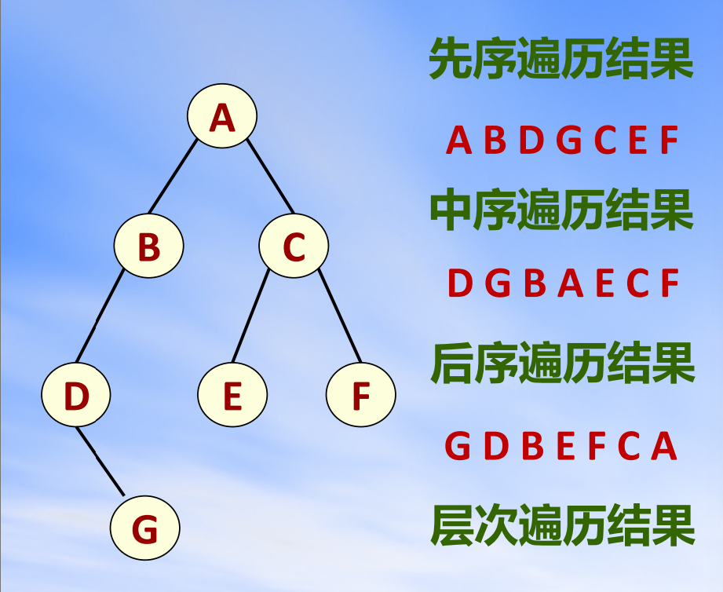

# 非递归实现二叉树的三种遍历

通过栈实现了二叉树的先序、中序和后序遍历。

## 调用方法

```cpp
    Traverse(rt,"rLR");
    Traverse(rt,"LrR");
    Traverse(rt,"LRr");
```

## 函数实现
```cpp
template<typename T>
void Traverse(BiNode<T>* rt,const char order[]){
    cout<<"Traverse(Order: "<<order<<"): ";

    stack<pair<BiNode<T>*,int>>s; s.emplace(rt,0);
    while(s.size()){
        auto [x,i]=s.top(); s.pop();
        if(i+1<3) s.emplace(x,i+1);
        switch(order[i]){
        case 'L':
            if(x->lson)
                s.emplace(x->lson,0);
            break;
        case 'R':
            if(x->rson)
                s.emplace(x->rson,0);
            break;
        case 'r':
            cout<<(x->elem)<<" ";
            break;
        default:
            cerr<<"invaild order!";
            exit(-1);
        }
    }

    cout<<endl;
}
```

## 测试

在目录下编译运行 [bitree.cpp](./bitree.cpp)
```bash
g++ bitree.cpp && ./a.out
```

运行结果
```
Traverse(Order: rLR): A B D G C E F 
Traverse(Order: LrR): D G B A E C F 
Traverse(Order: LRr): G D B E F C A
```



## 递归函数转非递归的一般方法

1. 找到函数的所有局部变量 $S$（包括参数）
2. 用一个变量 `PC` 表示函数内应执行的下一条语句
3. 使用栈存储 $S$ 和 `PC`
4. 每次根据栈顶信息执行指令，并更新 $S$ 和 `PC` 及进行入栈（函数调用）和出栈（函数结束）

非递归实现八皇后问题求解 [Code](./nqueens.cpp)