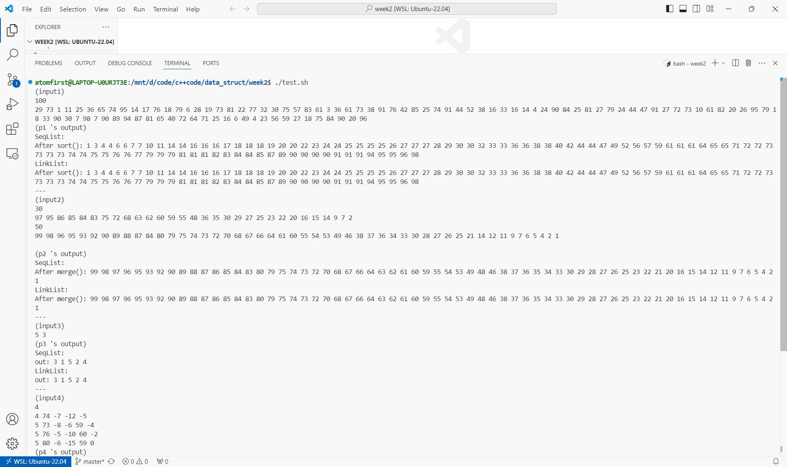
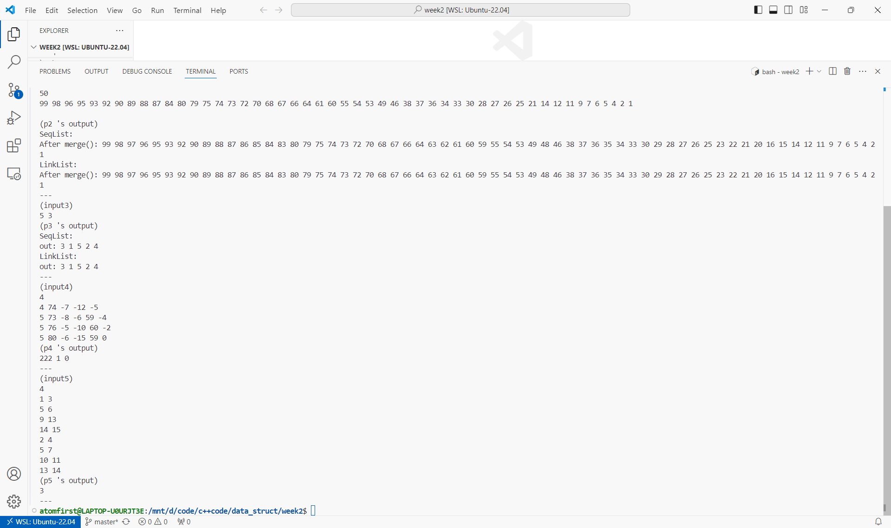

# 数据结构上机实验报告

> 要求代码和实验报告规范，在算法思想中：对实验涉及的数据结构进行有效设计和分析；对算法进行分析并给出时间、空间复杂度的结论；清晰表达实验思路、出现的问题及解决方法。

## 一、调试成功程序及说明

### 1.实现线性表冒泡排序

算法思想：

对一个长为 $n$ 的线性表 $a_1,a_2,...,a_n$ ，依次遍历 $i=1,2,...,n-1$ ，如果 $a_i>a_{i+1} $ ，交换 $a_i,a_{i+1}$ ，则 $max\{a_i\}$ 会被交换到第 $i$ 位，形如冒泡。

依次遍历 $j=n,n-1,...,2$ ，对 $a_1,a_2,...,a_j$ 进行上述操作，完成后 $a_1 \leq a_2 \leq ... \leq a_n$ 。

冒泡排序的时间复杂度是 $O(n^2)$ ，空间复杂度是 $O(1)$ 。

通过双向迭代器，可以给出统一的实现。

```cpp
template<typename T>
void BubbleSort(T &list){
    for(auto i=list.end();i!=list.begin();--i)
        for(auto j=list.begin(),k=++(list.begin());k!=i;++j,++k)
            if(*j>*k)
                swap(*j,*k);
}
```

运行结果：

`SquList` 和 `LinkList` 的实现在 [ADTList.cpp](./ADTList.cpp) 文件中，测试程序在 [p1.cpp](./p1.cpp) 中，测试数据在 [input/in1.txt](./input/in1.txt) 中。

请运行 `test.sh` 脚本获得各程序运行结果，即在命令行输入

```bash
chmod +x test.sh && ./test.sh
```

p1~p3运行截图


p4~p5运行截图


结果分析：符合预期。

（下面的程序运行结果和结果分析与第一题类似，不再重复）

### 2.实现有序集合求并（原地）

算法思想：

记 `a` 的头元素为 $x$ ，`b` 的头元素为 $y$ 。进行以下操作：

1. 若 $x<y$ ，则在 $x$ 之前插入 $y$ ，并令 $y:=next(y)$
2. 若 $x=y$ ，则令 $y:=nexy(y)$ ，跳到 `2`
3. 令 $x:=nexy(x)$ ，跳到 `1`
4. 将 `b` 中剩余元素依次插入 `a`

```cpp
template<typename T>
void Union(T &a,T &b){
    auto j=b.begin();
    for(auto i=a.begin();i!=a.end();++i)
        for(;j!=b.end() and *i<=*j;++j)
            if(*i<*j)
                i=a.insert(i,*j);
    for(;j!=b.end();++j)
        a.insert(a.end(),*j);
}
```

### 3.约瑟夫问题

算法思想：

暴力模拟即可，注意实现循环后缀 `cycle_next()` 。

```cpp
template<typename T>
void work(T &list,int m){
    auto cycle_next=[&](auto it){
        if(it==list.end())
            it=list.begin();
        ++it;
        if(it==list.end())
            it=list.begin();
        return it;
    };

    cout<<"out: ";
    for(auto it=list.begin();list.length();it=list.erase(it)){
        for(int i=1;i<m;i++)
            it=cycle_next(it);
        cout<<*it<<' ';
    }
    cout<<'\n';
}
```

### 4.CSP题目：苹果树

算法思想：

模拟。用一个线性表记录各树的果子数量，一个记录各数掉落总数。

```cpp
int main(){
    int n; cin>>n;
    vector<int>a(n),drop(n);
    for(int i=0;i<n;i++){
        int m; cin>>m>>a[i];
        for(int j=1;j<m;j++){
            int x; cin>>x;
            if(x>0)
                drop[i]+=a[i]-x,
                a[i]=x;
            else
                a[i]-=-x;
        }
    }

    ll sum=0,cnt=0,ec=0;

    for(int i=0;i<n;i++)
        sum+=a[i],
        cnt+=drop[i]>0?1:0;

    if(n>=3)
    for(int i=0;i<n;i++)
        ec+=(drop[i] and drop[(i+1)%n] and drop[(i+2)%n])?1:0;

    cout<<sum<<' '<<cnt<<' '<<ec<<'\n';

    return 0;
}
```

### 5.CSP题目：装车

算法思想：

模拟，区间交求法 $l_{new}=max\{l_{old}\},r_{new}=min\{r_{old}\}$ 。

```cpp
    ll res=0;
    for(int i=0;i<n;i++){
        int l,r; cin>>l>>r;
        for(int j=0;j<n;j++)
            res+=max(0,min(r,a[j][1])-max(l,a[j][0]));
    }
```

## 二、未调试成功程序及说明

无