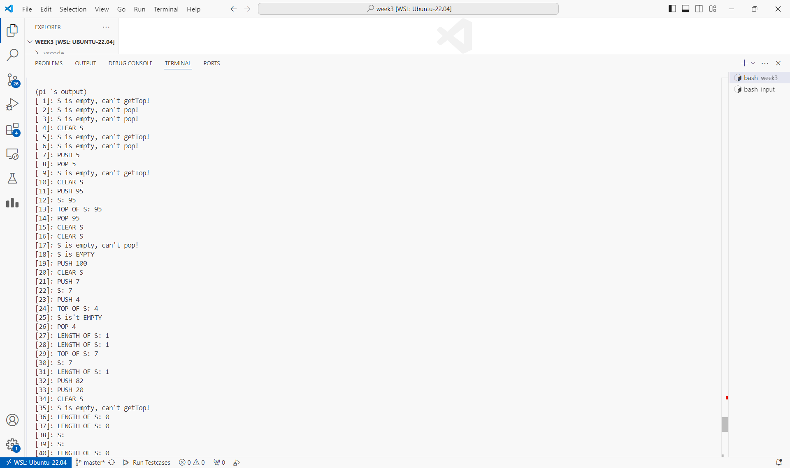
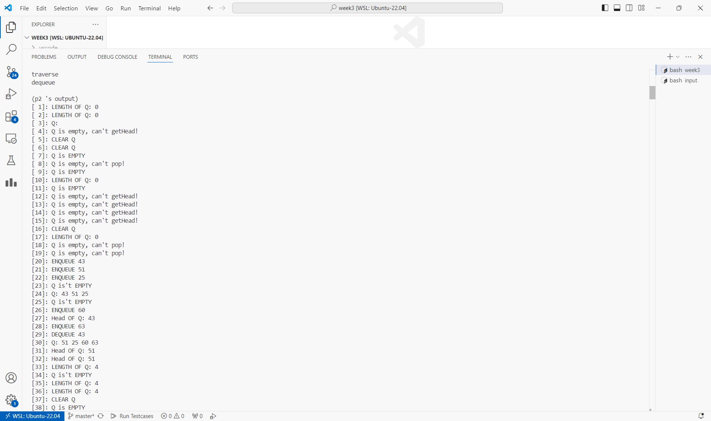
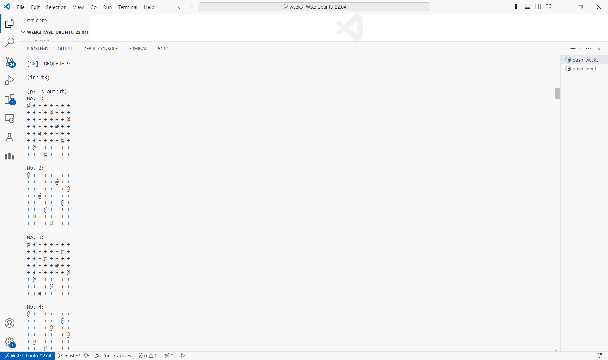
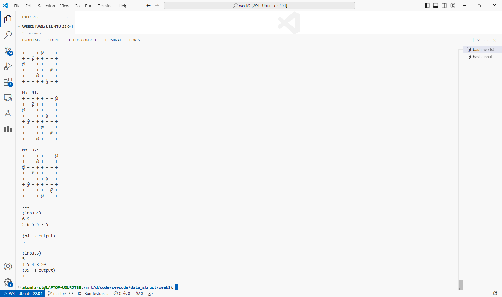

# 数据结构上机实验报告

> 要求代码和实验报告规范，在算法思想中：对实验涉及的数据结构进行有效设计和分析；对算法进行分析并给出时间、空间复杂度的结论；清晰表达实验思路、出现的问题及解决方法。

## 一、调试成功程序及说明

### 1.实现 ADT Stack 基本操作

算法思想：

本质是一个有限制的线性表，底层通过 `SquList` 实现。

运行结果：

`Stack` 的实现在 [ADTStack.cpp](./ADTStack.cpp) 文件中，测试程序在 [p1.cpp](./p1.cpp) 中，测试数据在 [input/in1.txt](./input/in1.txt) 中。

请运行 `test.sh` 脚本获得各程序运行结果，即在命令行输入

```bash
chmod +x test.sh && ./test.sh
```

p1~p5运行截图（部分，全部输出请运行脚本获得）





结果分析：符合预期。

（下面的程序运行结果和结果分析与第一题类似，不再重复）

### 2.实现 ADT Queue 基本操作

算法思想：

本质是一个有限制的线性表，底层通过 `LinkList` 实现。

### 3.非递归八皇后

算法思想：

记录每帧的搜索深度 `i` ，尝试位置 `j` ， 下一条指令 `pc` ， 模拟调用栈。

附：递归函数转非递归的一般方法

1. 找到函数的所有局部变量 $S$（包括参数）
2. 用一个变量 `PC` 表示函数内应执行的下一条语句
3. 使用栈存储 $S$ 和 `PC`
4. 每次根据栈顶信息执行指令，并更新 $S$ 和 `PC` 及进行入栈（函数调用）和出栈（函数结束）

```cpp
void solve(){
    Stack<stack_status>s; s.push({0,-1,0});
    while(s.length()){
        stack_status tmp; s.pop(tmp);
        auto &[i,j,pc]=tmp;
        switch(pc){
        case 0:
            if(i>=N) pc=1;
            else pc=2;
            s.push(tmp);
            break;
        case 1:
            show(); 
            break;
        case 2:
            for(++j;j<N;j++)
                if(valid(i,j)){
                    line[i]=j;
                    s.push(tmp);
                    s.push({i+1,-1,0});
                    break;
                }
            break;
        default:
            cerr<<"invaild pc!";
            exit(-1);
        }
    }
}
```

### 4.CSP题目：分蛋糕

算法思想：

模拟即可。

```cpp
int main(){
    int n,k; cin>>n>>k;
    int res=0,sum=0;
    for(int i=1,x;i<=n;i++){
        cin>>x; sum+=x;
        if(sum>=k)
            ++res,sum=0;
    }
    if(sum>0) ++res,sum=0;
    cout<<res<<endl;

    return 0;
}
```

### 5.CSP题目：最小差

算法思想：

显然有序序列中相邻两数之差的绝对值最小，遍历取 `min` 即可。

```cpp
int main(){
    int n; cin>>n;
    vector<int>a(n);
    for(int &x:a) cin>>x;
    sort(a.begin(),a.end());
    int res=1e9;
    for(int i=1;i<n;i++)
        res=min(res,a[i]-a[i-1]);
    cout<<res<<endl;

    return 0;
}
```

## 二、未调试成功程序及说明

无