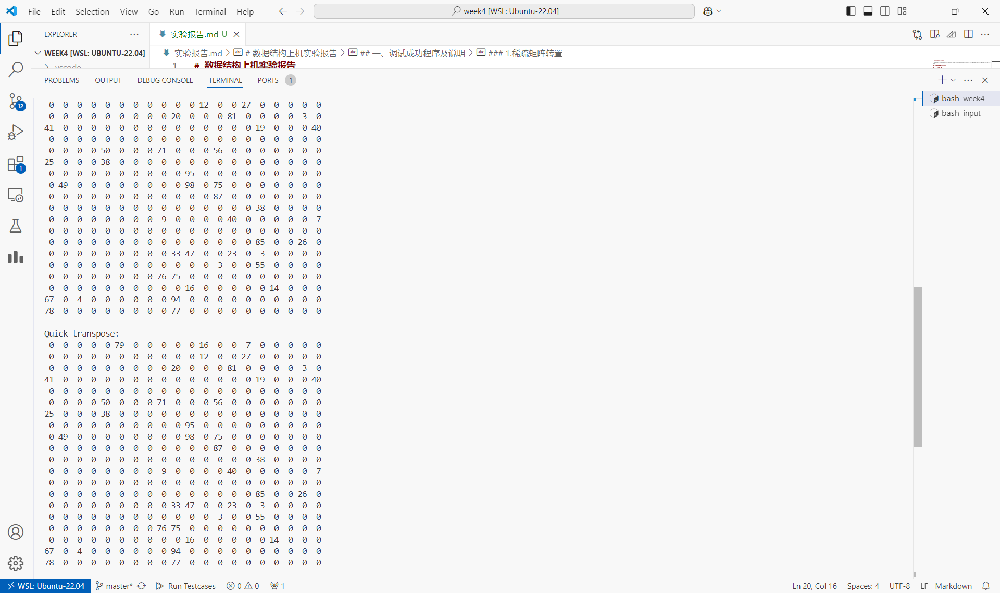

# 数据结构上机实验报告

> 要求代码和实验报告规范，在算法思想中：对实验涉及的数据结构进行有效设计和分析；对算法进行分析并给出时间、空间复杂度的结论；清晰表达实验思路、出现的问题及解决方法。

## 一、调试成功程序及说明

### 1.稀疏矩阵转置

算法思想：

- 遍历转置：遍历转置后的行和列，若有对应的源矩阵的非空元素则插入表尾，时间复杂度 $O(nmk)$ ( $n,m$ 为矩阵大小， $k$ 为非空元素个数)
- 快速转置：预处理转置后每行存储的下标范围（通过源矩阵的每列元素出现的次数进行前缀和得到），顺序遍历源矩阵的三元组并插入对应位置，时间复杂度 $O(k)$

```cpp
template<typename T>
Matrix<T> QuickTranspose(const Matrix<T> &mtr){
    Matrix<T> res;
    res.n=mtr.m; res.m=mtr.n;
    res.maxRow=mtr.maxColumn;
    res.maxColumn=mtr.maxRow;
    res.elem.resize(mtr.elem.size());

    vector<int>cnt(1+res.maxRow);

    for(const auto &[r,c,e]:mtr.elem)
        ++cnt[c];
    
    vector<int>index(1+res.maxRow);
    for(int i=1;i<index.size();i++)
        index[i]=index[i-1]+cnt[i-1];

    for(const auto &[r,c,e]:mtr.elem){
        res.elem[index[c]++]={c,r,e};
    }   

    return res;
}
```

运行结果：

测试程序在 [p1.cpp](./p1.cpp) 中，测试数据在 [input/in1.txt](./input/in1.txt) 中。

请运行 `test.sh` 脚本获得各程序运行结果，即在命令行输入

```bash
chmod +x test.sh && ./test.sh
```

p1~p4运行截图（部分，全部输出请运行脚本获得）



结果分析：符合预期。

（下面的程序运行结果和结果分析与第一题类似，不再重复）

### 2.求矩阵马鞍点

算法思想：

记录每行最小值和每列最大值，遍历矩阵判断是否符合定义

```cpp
template<typename T>
vector<tuple<int,int,T>> GetSaddlePoint(const Matrix<T> &mtr){
    vector<int> mn(mtr.n),mx(mtr.m);
    for(int i=0;i<mtr.n;i++)
        mn[i]=*min_element(all(mtr.elem[i]));
    for(int j=0;j<mtr.m;j++)
        for(int i=0;i<mtr.n;i++)
            mx[j]=max(mx[j],mtr.elem[i][j]);
    
    vector<tuple<int,int,T>> res;
    for(int i=0;i<mtr.n;i++)
        for(int j=0;j<mtr.m;j++)
            if(mtr.elem[i][j]==mn[i] and mtr.elem[i][j]==mx[j])
                res.emplace_back(i,j,mtr.elem[i][j]);
    return res;
}
```

### 3.CSP题目：应检尽检

算法思想：

模拟即可。

```cpp
int main(){
    int n,k,t,x1,y1,x2,y2; 
    cin>>n>>k>>t>>x1>>y1>>x2>>y2;
    int cnt1=0,cnt2=0;
    for(int i=1;i<=n;i++){
        int lx=0; bool first1=1,first2=1;
        for(int j=1;j<=t;j++){
            int x,y; cin>>x>>y;
            if(x1<=x and x<=x2 and y1<=y and y<=y2){
                if(first1) first1=0,++cnt1;
                if(first2 and ++lx>=k) first2=0,++cnt2;
            }else
                lx=0;
        }
    }
    cout<<cnt1<<endl<<cnt2<<endl;
    return 0;
}
```

### 4.CSP题目：座位分配

算法思想：

模拟即可。

```cpp
bool used[20][5];

int main(){
    int n; cin>>n;

    for(int i=1;i<=n;i++){
        int p; cin>>p;
        bool ok=0;
        for(int j=0;not ok and j<20;j++){
            int lx=0;
            for(int k=0;not ok and k<5;k++)
                if(not used[j][k]){
                    if(++lx>=p){
                        ok=1;
                        for(int l=0;l<p;l++)
                            used[j][k-p+1+l]=1,
                            cout<<(1+j*5+k-p+1+l)<<" ";
                    }
                }else
                    lx=0;
        }
        if(not ok){
            for(int j=0;p>0 and j<20;j++)
                for(int k=0;p>0 and k<5;k++)
                    if(not used[j][k])
                        used[j][k]=1,
                        cout<<(1+j*5+k)<<" ",
                        --p;
        }
        cout<<endl;
    }

    return 0;
}
```

## 二、未调试成功程序及说明

无