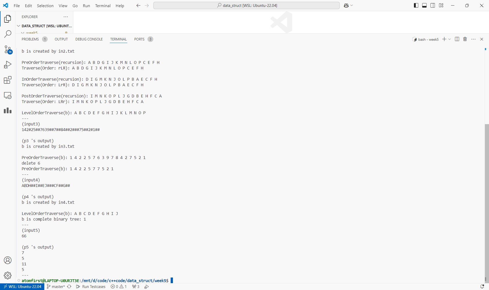

# 数据结构上机实验报告

> 要求代码和实验报告规范，在算法思想中：对实验涉及的数据结构进行有效设计和分析；对算法进行分析并给出时间、空间复杂度的结论；清晰表达实验思路、出现的问题及解决方法。

## 一、调试成功程序及说明

### 1.ADT BinaryTree实现

算法思想：

没有思想，仅实现了20个操作。

运行结果：

测试程序在 [p1.cpp](./p1.cpp) 中，测试数据在 [input/in1.txt](./input/in1.txt) 中。

请运行 `test.sh` 脚本获得各程序运行结果，即在命令行输入

```bash
chmod +x test.sh && ./test.sh
```

p1~p5运行截图



结果分析：符合预期。

（下面的程序运行结果和结果分析与第一题类似，不再重复）

### 2.实现二叉树各种遍历

算法思想：

非递归实现类似实验三的非递归八皇后。

```cpp
template<typename T>
void Traverse(const BiTree<T>& b,const char order[],auto &&worker){
    cout<<"Traverse(Order: "<<order<<"): ";

    stack<pair<BiNode<T>*,int>>s; s.emplace(b.root,0);
    while(s.size()){
        auto [x,i]=s.top(); s.pop();
        if(i+1<3) s.emplace(x,i+1);
        switch(order[i]){
        case 'L':
            if(x->lchild)
                s.emplace(x->lchild,0);
            break;
        case 'R':
            if(x->rchild)
                s.emplace(x->rchild,0);
            break;
        case 'r':
            worker(x->data);
            break;
        default:
            cerr<<"invaild order!";
            exit(-1);
        }
    }

    cout<<endl;
}
```

### 3.删除根的值为x的子树

算法思想：

先序遍历并删除即可。

```cpp
template<typename T>
bool DeleteValXChild(BiTree<T>& b,const T &x){
    if(not b.root) return 0;
    if(b.getRoot()==x){
        b.clear();
        return 1;
    }
    auto lt=BiTree<T>(b.root->lchild);
    if(DeleteValXChild(lt,x)) b.root->lchild=nullptr;
    auto rt=BiTree<T>(b.root->rchild);
    if(DeleteValXChild(rt,x)) b.root->rchild=nullptr;
    return 0;
}
```

### 4.判断完全二叉树

算法思想：

分治。后序遍历，对每个子树记录是否为完全二叉树及最大深度和最小深度，并进行合并，时间复杂度 $O(n)$ 。

```cpp
template<typename T>
tuple<int,int,bool> _IsComplete(BiNode<T>* b){
    if(not b) return {-1,-1,true};
    auto [ll,lr,lb]=_IsComplete(b->lchild);
    auto [rl,rr,rb]=_IsComplete(b->rchild);
    if(lb and rb and lr>=rl and ll-rr<=1)
        return {1+ll,1+rr,true};
    return {-1,-1,false};
}
```

### 5.CSP题目：跳过7

算法思想：

模拟即可。

```cpp
bool jumping(int n){
    if(n%7==0) return true;
    for(;n;n/=10)
        if(n%10==7)
            return true;
    return false;
}

int main(){
    int n; cin>>n;
    int cnt[]{0,0,0,0};
    for(int i=0,j=1;n>0;i=(i+1)%4,++j)
        if(jumping(j)) ++cnt[i];
        else --n;
    for(int x:cnt)
        cout<<x<<endl;
    return 0;
}
```

## 二、未调试成功程序及说明

无