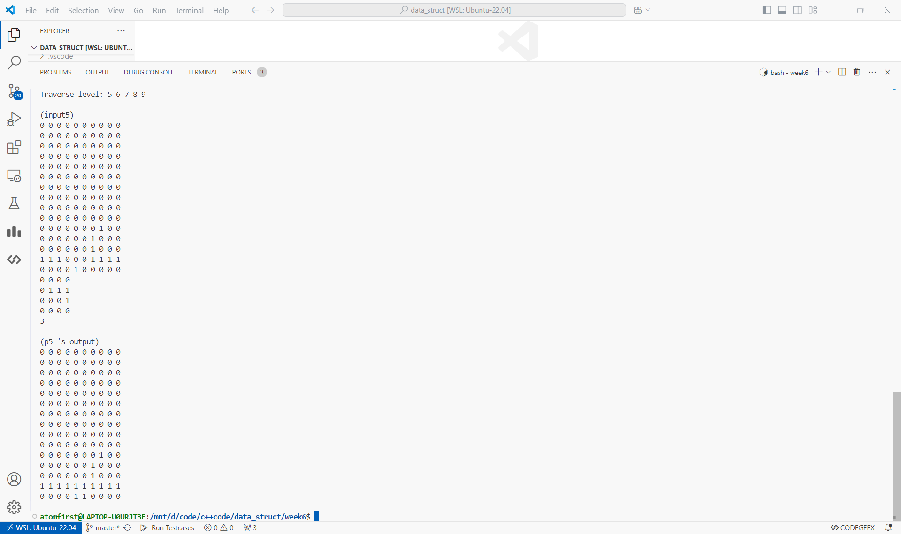

# 数据结构上机实验报告

> 要求代码和实验报告规范，在算法思想中：对实验涉及的数据结构进行有效设计和分析；对算法进行分析并给出时间、空间复杂度的结论；清晰表达实验思路、出现的问题及解决方法。

## 一、调试成功程序及说明

### 1.ADT Graph实现

算法思想：

用邻接矩阵实现了图的存储和基本操作。

运行结果：

测试程序在 [p1.cpp](./p1.cpp) 中，测试数据在 [input/in1.txt](./input/in1.txt) 中。

请运行 `test.sh` 脚本获得各程序运行结果，即在命令行输入

```bash
chmod +x test.sh && ./test.sh
```

p1~p5运行截图（部分，全部结果请运行脚本获得）




结果分析：符合预期。

（下面的程序运行结果和结果分析与第一题类似，不再重复）

### 2.对数据进行哈夫曼编码

算法思想：

将所有频度放入堆中，每次取出两个频度最小的节点合并，直到堆中只剩下一个节点，此时该节点即为根节点，从根节点到每个叶子节点的路径即为该叶子节点的哈夫曼编码。

```cpp
while(q.size()>1){
    auto [fx,ix]=q.top(); q.pop();
    auto [fy,iy]=q.top(); q.pop();
    ++tot;
    left[tot]=ix; right[tot]=iy;
    q.emplace(fx+fy,tot);
}
```

### 3.求二叉树宽度

算法思想：

遍历得到每层节点数量并取最大值。

```cpp
int weight(){
    if(root==0) return 0;

    map<int,int>d2c;
    auto dfs=[&](auto&& self,int x,int d){
        if(x==0) return;
        ++d2c[d];
        self(self,left[x],d+1);
        self(self,right[x],d+1);    
    };
    dfs(dfs,root,0);

    int res=0;
    for(auto [d,c]:d2c)
        res=max(res,c);
    return res;
}
```

### 4.输出第 i 层所有元素

算法思想：

遍历，到第 $i$ 层就输出 。

```cpp
void TraverseLevelI(Node* tree,int i){
    if(i==1)
        for(;tree;tree=tree->sibing)
            cout<<tree->data<<" ";
    else
        for(;tree;tree=tree->sibing)
            TraverseLevelI(tree->child,i-1);
}
```

### 5.CSP题目：俄罗斯方块

算法思想：

模拟即可。

```cpp
int i=0; bool ok=0;
while(1){
    for(auto [y,x]:t)
        if(y-(i+1)<0 || grip[y-(i+1)][x])
            ok=1;
    if(ok) break;
    ++i;
}
```

## 二、未调试成功程序及说明

无