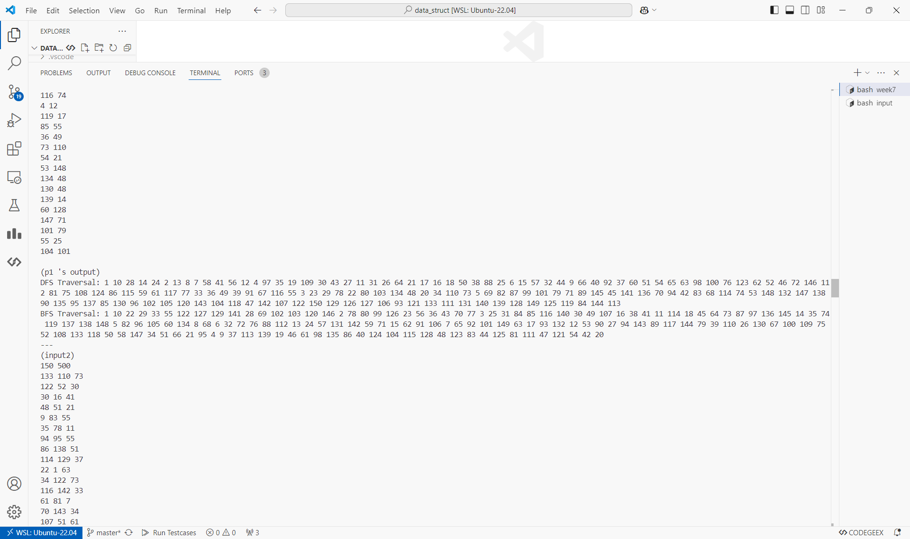
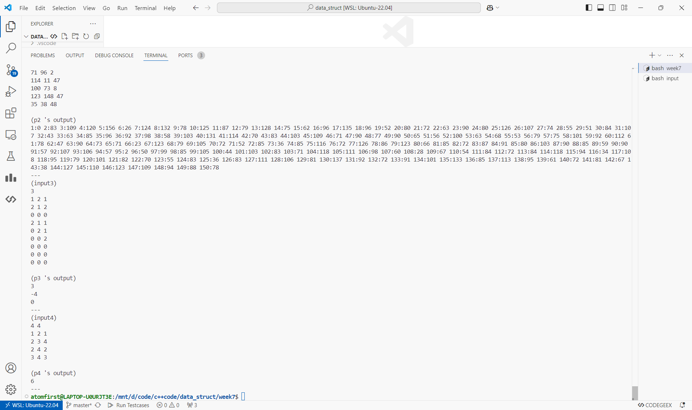

# 数据结构上机实验报告

> 要求代码和实验报告规范，在算法思想中：对实验涉及的数据结构进行有效设计和分析；对算法进行分析并给出时间、空间复杂度的结论；清晰表达实验思路、出现的问题及解决方法。

## 一、调试成功程序及说明

### 1.图的深度优先和广度优先遍历

算法思想：

如题。

运行结果：

测试程序在 [p1.cpp](./p1.cpp) 中，测试数据在 [input/in1.txt](./input/in1.txt) 中。

请运行 `test.sh` 脚本获得各程序运行结果，即在命令行输入

```bash
chmod +x test.sh && ./test.sh
```

p1~p4运行截图（部分，全部结果请运行脚本获得）



结果分析：符合预期。

（下面的程序运行结果和结果分析与第一题类似，不再重复）

### 2.Dijkstra

算法思想：

每次通过已知的最短路径松弛其他最短路径，并将其他最短路径中最小的加入已知最短路径。

```cpp
auto dijkstra=[&](int s){
    vector<int>vis(n+1);
    priority_queue<pair<int,int>>q;
    q.push({0,s}); dis[s]=0;
    while(!q.empty()){
        auto [d,u]=q.top(); d=-d; q.pop();
        if(vis[u]) continue; vis[u]=1;
        for(auto [v,w]:g[u])
            if(dis[v]>d+w)
                dis[v]=d+w,
                q.push({-dis[v],v});
    }
};
```

### 3.井字棋

算法思想：

最大最小搜索。

```cpp
int dfs(int first){
    if(win(first)) return cntn(0)+1;
    if(win(3-first)) return -cntn(0)-1;
    if(end()) return 0;

    int res=-10000;
    for(int i=0;i<3;i++)
        for(int j=0;j<3;j++){
            if(grip[i][j]!=0) continue;
            grip[i][j]=first;
            res=max(res,-dfs(3-first));
            grip[i][j]=0;
        }
    return res;
}
```

### 4.引水

算法思想：

最小生成树。

```cpp
for(int i=0;i<m;i++){
    if(cs==n-1)break;
    if(getf(b[i].x)==getf(b[i].y))continue;
    f[getf(b[i].x)]=getf(b[i].y);
    cs++;
    ans=ans+b[i].z;
}
```

## 二、未调试成功程序及说明

无