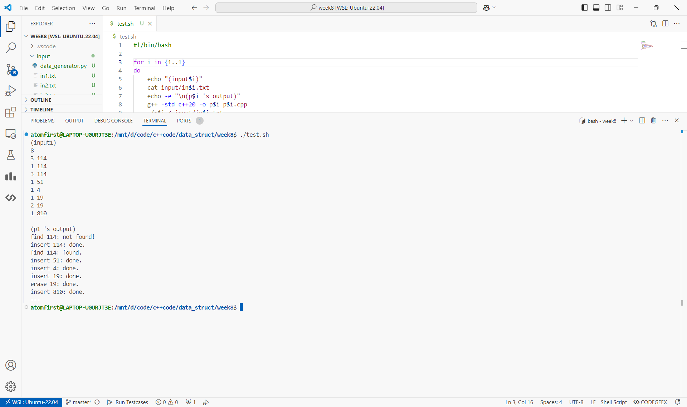
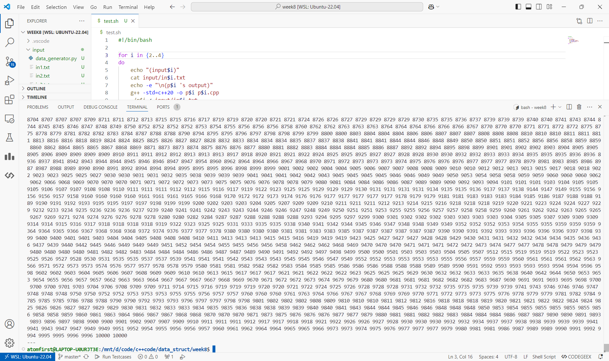
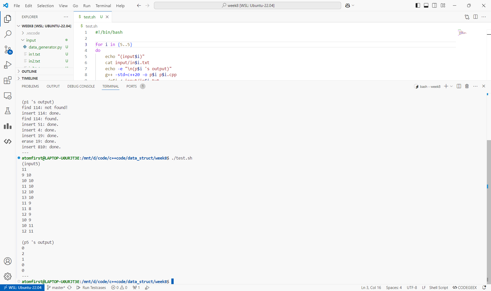

# 数据结构上机实验报告

> 要求代码和实验报告规范，在算法思想中：对实验涉及的数据结构进行有效设计和分析；对算法进行分析并给出时间、空间复杂度的结论；清晰表达实验思路、出现的问题及解决方法。

## 一、调试成功程序及说明

### 1.二叉查找树的插入和删除

算法思想：

找到位置后插入。删除需特判根节点。若删除节点有两个子节点，则用右子树中最小的节点代替删除节点。

```cpp
bool insert(const T& data){
    if(contain(data)) return false;
    if(root == nullptr)
        root = new Node{data,nullptr,nullptr};
    else{
        Node* cur = root;
        while(true)
            if(cur->data < data)
                if(cur->right) cur = cur->right;
                else break;
            else
                if(cur->left) cur = cur->left;
                else break;
        
        if(cur->data < data)
            cur->right = new Node{data,nullptr,nullptr};
        else
            cur->left = new Node{data,nullptr,nullptr};
    }
    return true;
}
```

运行结果：

测试程序在 [p1.cpp](./p1.cpp) 中，测试数据在 [input/in1.txt](./input/in1.txt) 中。

请运行 `test.sh` 脚本获得各程序运行结果，即在命令行输入

```bash
chmod +x test.sh && ./test.sh
```

p1~p5运行截图（部分，全部结果请运行脚本获得）




结果分析：符合预期。

（下面的程序运行结果和结果分析与第一题类似，不再重复）

### 2.冒泡选择归并排序

算法思想：

- 冒泡：每次将最大的数滚到后面，依次对 $[l,r],[l,r-1],[l,r-2],...,[l,l+1]$ 操作。
- 选择：每次选择最小的数交换到前面，依次对 $[l,r],[l+1,r],[l+2,r],...,[r-1,r]$ 操作。
- 归并：将数组分成两半，分别排序后合并。

```cpp
template<typename T>
void BubbleSort(T begin,T end){
    for(;end-begin>1;--end)
        for(T i=begin,j=begin+1;j!=end;++i,++j)
            if(*i>*j)
                swap(*i,*j);
}

template<typename T>
void SelectSort(T begin,T end){
    for(;end-begin>1;++begin){
        T minp=begin;
        for(T i=begin+1;i!=end;++i)
            if(*minp>*i)
                minp=i;
        swap(*minp,*begin);
    }
}

template<typename T>
void MergeSort(T begin,T end){
    if(end-begin<=1) return;
    T mid=begin+(end-begin)/2;
    MergeSort(begin,mid);
    MergeSort(mid,end);
    
    auto tmp=*begin;
    vector<decltype(tmp)>buf1(begin,mid),buf2(mid,end);
    
    auto it1=buf1.begin(),it2=buf2.begin();
    for(;it1!=buf1.end() && it2!=buf2.end();++begin)
        if(*it1<*it2) *begin=*it1++;
        else *begin=*it2++;
    
    for(;it1!=buf1.end();++it1,++begin) *begin=*it1;
    for(;it2!=buf2.end();++it2,++begin) *begin=*it2;
}
```

### 3.快速排序

算法思想：

快速排序：每次选择一个基准，将比它小的数放在它前面，比它大的数放在它后面，然后对前后两部分递归排序。

```cpp
template<typename T>
void QuickSort(T begin,T end){
    if(end-begin<=1) return;
    auto base=*begin;
    T l=begin,r=end; --r;
    while(l!=r){
        while(l!=r && *r>=base) --r;
        *l=*r;
        while(l!=r && *l<=base) ++l;
        *r=*l;
    }
    *l=base;

    QuickSort(begin,l);
    QuickSort(l+1,end);
}
```

### 4.堆排序

算法思想：

从大顶堆中取出根节点作为最大元素，然后调整堆，取出次大元素，直到取完。通过合理的操作，可以原地进行。

```cpp
template<typename T>
void HeapSort(T begin,T end){
    int n=end-begin;

	auto heapify=[&](auto&& self,int i)->void{
	    auto& cur=*(begin+i);
		int pl=i*2+1,pr=i*2+2;
		if(pr<n){
		    auto &l=*(begin+pl),&r=*(begin+pr);
			if(max(l,r)<=cur) return;
			if(l>r){
			    swap(l,cur);
				self(self,pl);
			}
			else{
			    swap(r,cur);
				self(self,pr);
			}
		}
		else if(pl<n && *(begin+pl)>cur)
		    swap(*(begin+pl),cur);
	};

    for(int i=n/2-1;i>=0;i--) heapify(heapify,i);

    while(--n){
        swap(*begin,*(begin+n));
		heapify(heapify,0);
    }
}
```

### 5.CSP题目：回收站统计

算法思想：

模拟即可。

```cpp
for(auto [x,y]:s){
    bool ok=1;
    for(int i=0;i<4;i++)
        if(s.count({x+dx[i],y+dy[i]})==0)
            ok=0;
    if(!ok) continue;
    int cnt=0;
    for(int i=4;i<8;i++)
        if(s.count({x+dx[i],y+dy[i]}))
            ++cnt;
    ++res[cnt];
}
```

## 二、未调试成功程序及说明

无